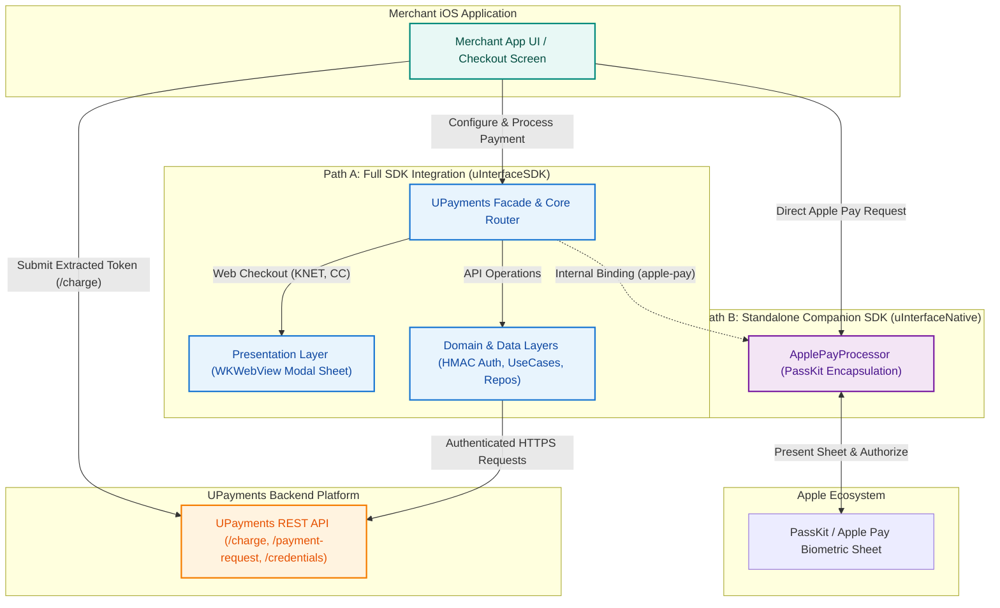
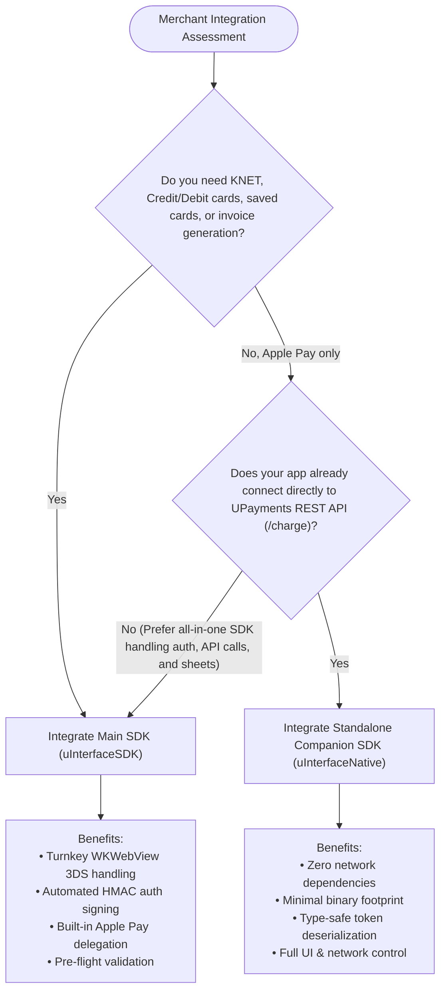
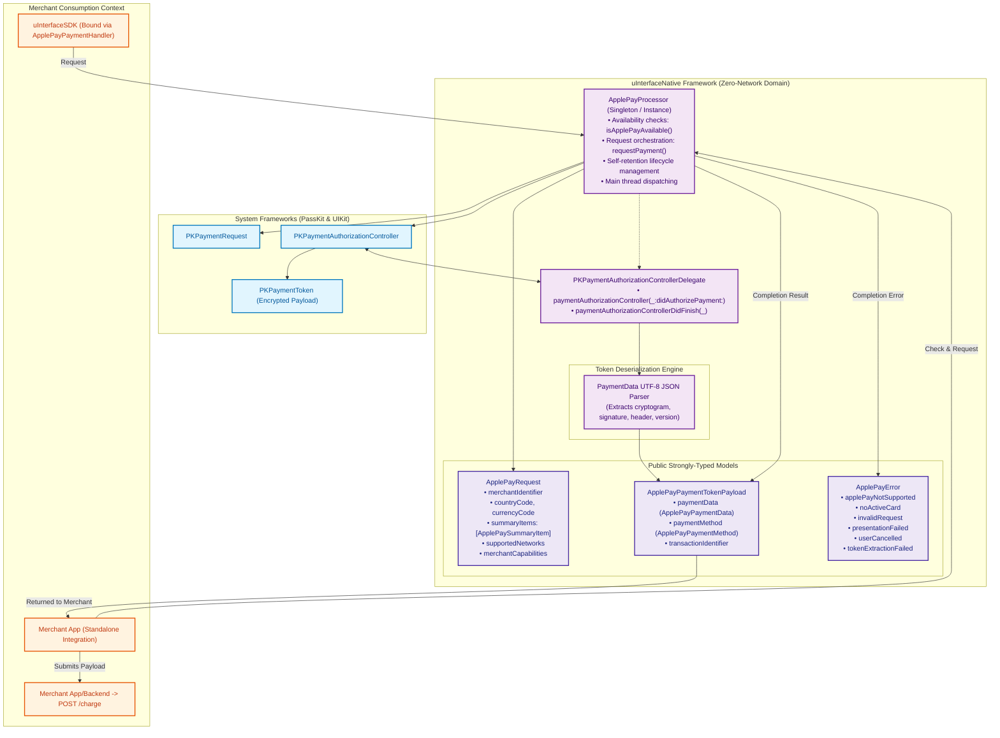
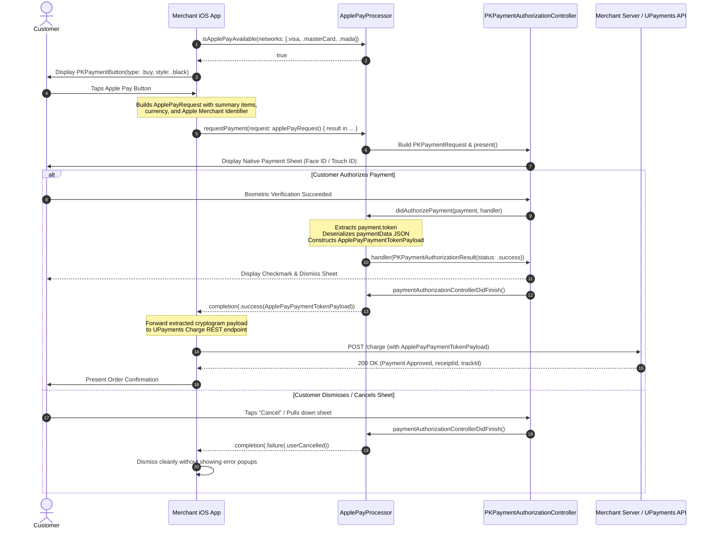
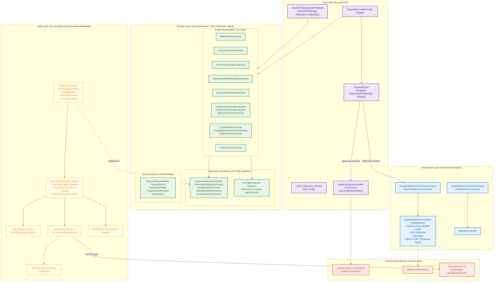
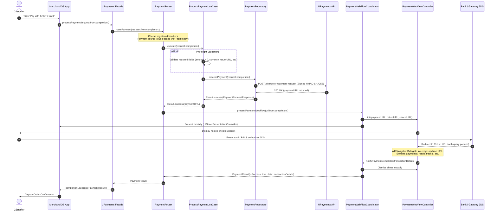
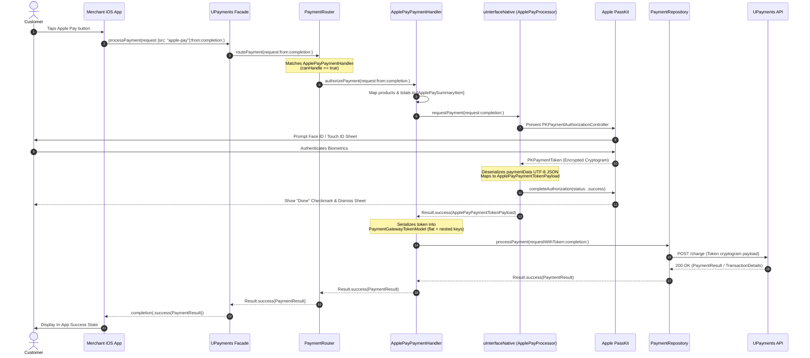
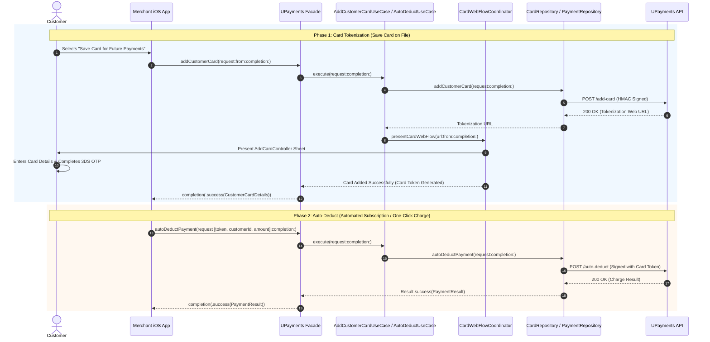

# UPayments iOS SDKs: Architecture & Sequence Diagrams

This document provides architectural blueprints and comprehensive sequence diagrams for both the **Companion SDK (`uInterfaceNative`)** and the **Main SDK (`uInterfaceSDK`)**, as documented in:
- [`docs/companion-sdk.md`](file:///Users/siyahulhaq/Work/UPayments/SDKs/uInterfaceNative/docs/companion-sdk.md)
- [`../iOS-SDK/docs/main-sdk.md`](file:///Users/siyahulhaq/Work/UPayments/SDKs/iOS-SDK/docs/main-sdk.md)

---

## Table of Contents

1. [Architectural Overview & Integration Paths](#1-architectural-overview--integration-paths)
2. [Integration Path Decision Tree](#2-integration-path-decision-tree)
3. [Companion SDK (`uInterfaceNative`) Architecture](#3-companion-sdk-uinterfacenative-architecture)
   - [3.1 Zero-Network PassKit Orchestration Diagram](#31-zero-network-passkit-orchestration-diagram)
   - [3.2 Design Characteristics](#32-design-characteristics)
4. [Companion SDK Sequence Diagram](#4-companion-sdk-sequence-diagram)
   - [4.1 Sequence Diagram: Standalone Direct Apple Pay & Charge API Flow](#41-sequence-diagram-standalone-direct-apple-pay--charge-api-flow)
5. [Main SDK (`uInterfaceSDK`) Architecture](#5-main-sdk-uinterfacesdk-architecture)
   - [5.1 Clean Architecture Layer Diagram](#51-clean-architecture-layer-diagram)
   - [5.2 Architectural Invariants & Boundary Rules](#52-architectural-invariants--boundary-rules)
6. [Main SDK Sequence Diagrams](#6-main-sdk-sequence-diagrams)
   - [6.1 Sequence Diagram: Web / Hosted Checkout (KNET & Credit Card)](#61-sequence-diagram-web--hosted-checkout-knet--credit-card)
   - [6.2 Sequence Diagram: Native Apple Pay via Companion SDK Binding](#62-sequence-diagram-native-apple-pay-via-companion-sdk-binding)
   - [6.3 Sequence Diagram: Card Tokenization & Auto-Deduct Billing](#63-sequence-diagram-card-tokenization--auto-deduct-billing)
7. [Comparative Summary: Main SDK vs Companion SDK](#7-comparative-summary-main-sdk-vs-companion-sdk)

---

## 1. Architectural Overview & Integration Paths

Merchants integrating UPayments on iOS can adopt one of two architectural patterns depending on whether they require a complete turnkey checkout experience or a lightweight, native-only Apple Pay component:

---

## 2. Integration Path Decision Tree

Use the following flowchart to determine whether to integrate the **Main SDK (`uInterfaceSDK`)** or the standalone **Companion SDK (`uInterfaceNative`)**:

---

## 3. Companion SDK (`uInterfaceNative`) Architecture

The standalone **`uInterfaceNative`** framework is an ultra-lightweight, zero-network companion designed solely for native Apple Pay orchestration and token parsing.

### 3.1 Zero-Network PassKit Orchestration Diagram

### 3.2 Design Characteristics

- **Zero Network Invariant**: `uInterfaceNative` never initiates HTTP requests. It contains no networking libraries, ensuring merchants full sovereignty over their networking stack.
- **PassKit Encapsulation**: Masks complex `PKPaymentAuthorizationController` boilerplate, delegate methods, and retained lifecycle state.
- **Deterministic Threading**: Completion handlers are guaranteed to execute on `DispatchQueue.main`, protecting calling applications from threading hazards.
- **Deep Token Parsing**: Converts raw UTF-8 `PKPaymentToken.paymentData` bytes into strongly typed Swift structs (`ApplePayPaymentData`, `ApplePayPaymentMethod`), matching UPayments' backend `/charge` specification directly.

---

## 4. Companion SDK Sequence Diagram

### 4.1 Sequence Diagram: Standalone Direct Apple Pay & Charge API Flow

---

## 5. Main SDK (`uInterfaceSDK`) Architecture

The Main SDK follows **Clean Architecture** principles. The codebase is organized into four distinct rings of responsibility where dependencies flow strictly inward.

### 5.1 Clean Architecture Layer Diagram

---

### 5.2 Architectural Invariants & Boundary Rules

1. **Zero-Network & Zero-UI Domain Layer**: `Sources/Domain/` never imports `UIKit`, `WebKit`, or networking clients. All domain logic depends strictly on repository interfaces (`PaymentRepositoryProtocol`, etc.).
2. **Pre-Flight Validation Mandate**: In-SDK default fallbacks are strictly prohibited. Every Use Case validates required fields (e.g., `amount > 0`, `currency`, `language`, `returnURL`, `cancelURL`) and fails fast with `NetworkError.validationFailed(reason:missingFields:)`.
3. **Pluggable Payment Routing**: The `PaymentRouter` decouples native handlers from web coordinators. Any payment source (`src == "apple-pay"`) is dynamically intercepted by its registered `PaymentMethodHandler`.
4. **Backward Compatibility**: Legacy interfaces (`PaymentGatewayImplementation.shared.paymentStoreUseCase` and `PaymentAPIManager`) are preserved via adapters that forward calls to modern Use Cases without changing public method signatures.

---

## 6. Main SDK Sequence Diagrams

### 6.1 Sequence Diagram: Web / Hosted Checkout (KNET & Credit Card)

---

### 6.2 Sequence Diagram: Native Apple Pay via Companion SDK Binding

---

### 6.3 Sequence Diagram: Card Tokenization & Auto-Deduct Billing

---

## 7. Comparative Summary: Main SDK vs Companion SDK

| Architectural Dimension | Main SDK (`uInterfaceSDK`) | Companion SDK (`uInterfaceNative`) |
| :--- | :--- | :--- |
| **Primary Architectural Role** | Full-featured, turnkey payment gateway framework | Lightweight PassKit helper & token extraction library |
| **Layering Model** | Clean Architecture (Domain, Data, Presentation, Core) | Single-module service encapsulation |
| **Networking Responsibility** | Built-in (`URLSessionNetworkClient`, HMAC signer, endpoint mapping) | **Zero networking** (merchant or host SDK handles network calls) |
| **UI Presentation** | Modal `WKWebView` coordinators + native Apple Pay sheet | Apple-native `PKPaymentAuthorizationController` sheet only |
| **Supported Payment Rails** | KNET, Credit/Debit cards, Apple Pay, Recurring Auto-Deduct | Apple Pay only |
| **Pre-Flight Validation** | Strict domain validation engine (fails fast on missing fields) | Validates Apple Pay configuration and active wallet cards |
| **Token Handling** | Automatically serializes and transmits tokens to `/charge` | Extracts & returns typed `ApplePayPaymentTokenPayload` to caller |
| **Error Architecture** | `NetworkError` (typed status, code, validation fields) | `ApplePayError` (PassKit and authorization specific enums) |
| **CocoaPods Podspec** | `uInterfaceSDK.podspec` (links `uInterfaceNative.xcframework`) | `uInterfaceNative.podspec` (standalone pod) |
| **SPM Support** | `Package.swift` referencing binary targets | Standalone Swift Package |

---

## 8. Cross-Reference Index

- **Main SDK Merchant Integration Guide**: [`../iOS-SDK/docs/main-sdk.md`](file:///Users/siyahulhaq/Work/UPayments/SDKs/iOS-SDK/docs/main-sdk.md)
- **Companion SDK Merchant Integration Guide**: [`docs/companion-sdk.md`](file:///Users/siyahulhaq/Work/UPayments/SDKs/uInterfaceNative/docs/companion-sdk.md)
- **CocoaPods Publishing Guide**: [`docs/publishing-to-cocoapods.md`](file:///Users/siyahulhaq/Work/UPayments/SDKs/uInterfaceNative/docs/publishing-to-cocoapods.md)
